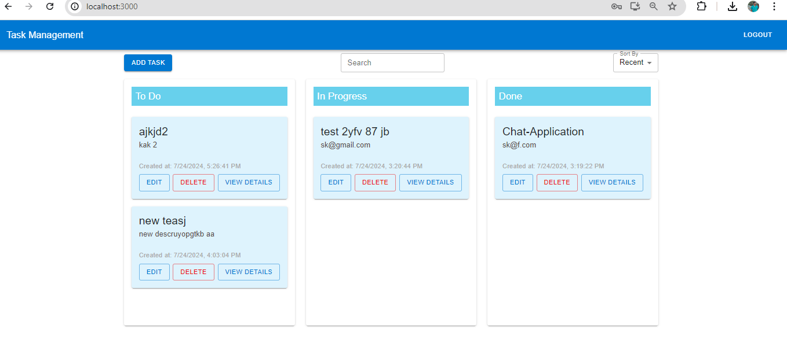
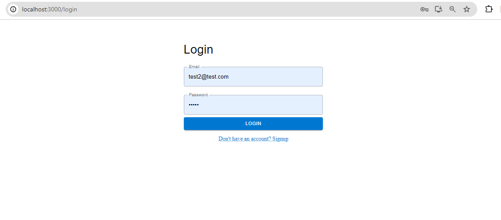
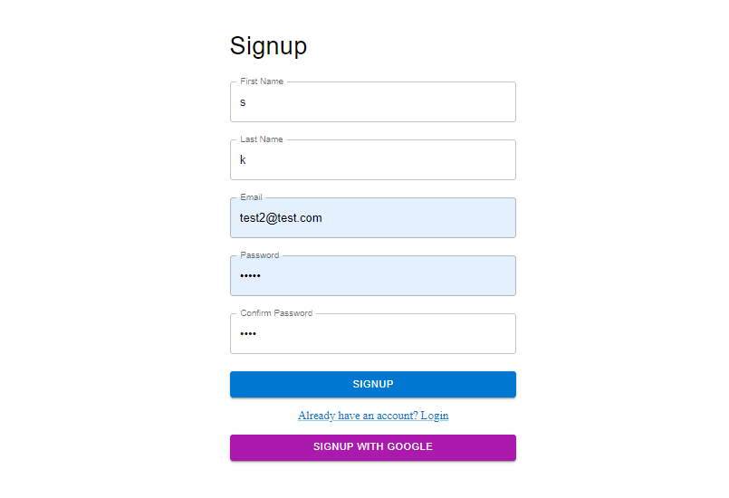

# MERN Stack Project

## Overview

This project is a simple MERN (MongoDB, Express, React, Node.js) stack application with user authentication and task management functionalities. It includes three main pages:
- **Login:** Allows users to log in to the application.
- **Register:** Allows new users to create an account.
- **Task Management:** Allows users to manage their tasks.

Sample Snapshots:

### Task page


### Login Page


### Register Page



## Features

- **User Authentication:** Users can register and log in to the application.
- **Task Management:** Authenticated users can create, read, update, and delete tasks.

## Project Structure

```
/mern-stack-project
│
├── client/                # React frontend
│   ├── public/            # Public files
│   ├── src/               # Source files
│   │   ├── actions/       # Redux actions
│   │   ├── components/    # React components
│   │   ├── reducers/      # Redux reducers
│   │   ├── screens/       # Screens (Login, Register, Task Management)
│   │   ├── App.js         # Main React component
│   │   └── index.js       # Entry point
│   └── package.json       # Frontend dependencies
│
├── server/                # Node.js backend
│   ├── controllers/       # Controllers for handling requests
│   ├── models/            # Mongoose models
│   ├── routes/            # API routes
│   ├── config/            # Configuration files (e.g., database config)
│   ├── middleware/        # Middleware (e.g., authentication middleware)
│   ├── server.js          # Entry point
│   └── package.json       # Backend dependencies
│
├── .gitignore              # Git ignore file
└── README.md               # This file
```

## Getting Started

### Prerequisites

- Node.js (version 14.x or later)
- npm (version 6.x or later)
- MongoDB (local or remote)

### Installation

1. **Clone the repository:**

   ```bash
   git clone https://github.com/your-username/mern-stack-project.git
   cd mern-stack-project
   ```

2. **Install server dependencies:**

   ```bash
   cd server
   npm install
   ```

3. **Install client dependencies:**

   ```bash
   cd ../client
   npm install
   ```

4. **Configure environment variables:**

   - Create a `.env` file in the `server` directory and add your MongoDB connection string:

     ```env
     MONGODB_URI=mongodb://localhost:27017/your-database-name
     JWT_SECRET=your-jwt-secret
     ```

5. **Run the development server:**

   - Start the backend server:

     ```bash
     cd server
     npm start
     ```

   - In a separate terminal, start the frontend server:

     ```bash
     cd client
     npm start
     ```

   The application will be available at `http://localhost:3000` by default.

## Usage

### Login

- Navigate to `/login` to log in to the application.
- Enter your email and password and click "Login".

### Register

- Navigate to `/register` to create a new account.
- Fill in the registration form and click "Register".

### Task Management

- After logging in, navigate to `/tasks` to manage your tasks.
- You can create, read, update, and delete tasks.

## API Endpoints

### Authentication

- **POST /api/auth/register:** Register a new user.
- **POST /api/auth/login:** Log in a user.

### Tasks

- **GET /api/tasks:** Retrieve all tasks for the logged-in user.
- **POST /api/tasks:** Create a new task.
- **PUT /api/tasks/:id:** Update a task.
- **DELETE /api/tasks/:id:** Delete a task.

## Technologies Used

- **Frontend:**
  - React
  - Redux
  - Material-UI

- **Backend:**
  - Node.js
  - Express
  - MongoDB
  - Mongoose
  - JWT (JSON Web Tokens)

## Contributing

Contributions are welcome! Please open an issue or submit a pull request with improvements or bug fixes.

## License

This project is licensed under the MIT License.
